# Globally and Locally Consistent Image Completion (GLCIC)

This is an implementation of the image completion model proposed in the paper
([Globally and Locally Consistent Image Completion](
http://hi.cs.waseda.ac.jp/%7Eiizuka/projects/completion/data/completion_sig2017.pdf))
with TensorFlow.


# Requirements

- Python 3
- TensorFlow 1.3
- OpenCV


# Results


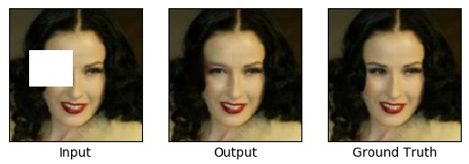

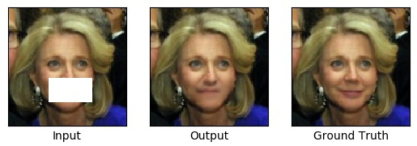


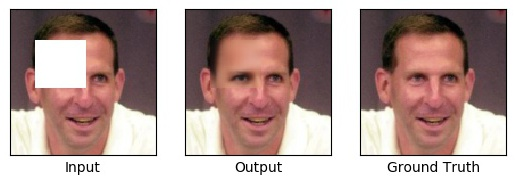

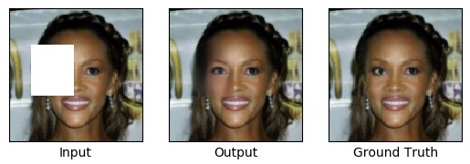

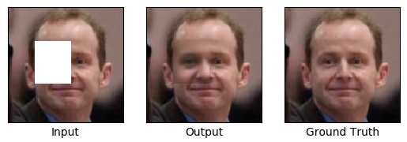

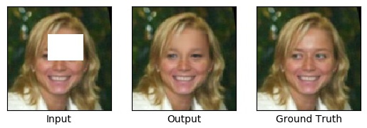

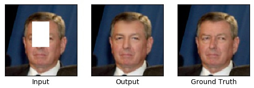

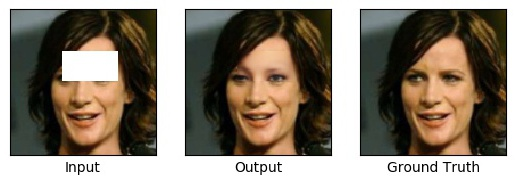

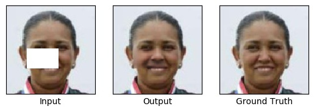

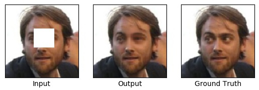

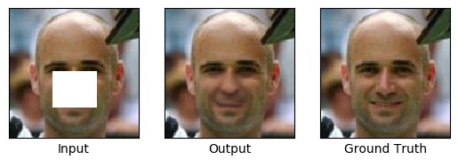


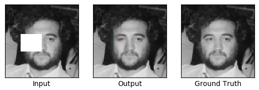

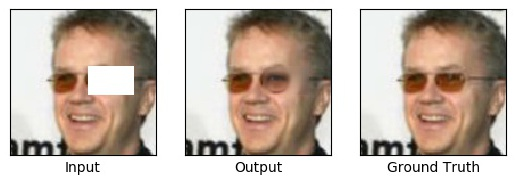


# Usage

## I. Prepare the training data

Put the images for training the "data/images" directory and convert images to npy format.

```
$ cd data
$ python to_npy.py
```

When you use the face images for training, it is recommended that you align the face landmarks with dlib before training.
If you have no time for preprocessing, utilize [mirror padding](
https://github.com/tadax/image_processor/tree/master/mirror_padding).


## II. Train the GLCIC model

```
$ cd src
$ python train.py
```


# Approach

This implementation uses 128x128 images as training data unlike paper.
So the both discriminators have 1 conv layer fewer;
that is, the local and global discriminator have 4 and 5 conv layers, respectively.

I trained the GLCIC model using 5,434 face images collected from the Internet.
The paper says the training should be split into three phases, but I skipped the second step.
The completion network is trained with the MSE loss for 100 interatinos;
then both the completion network and discriminator are trained to reach the total of 400 iterations.
The entire training procedure takes roughly 16 hours on a single machine equipped with a GTX 1070.

